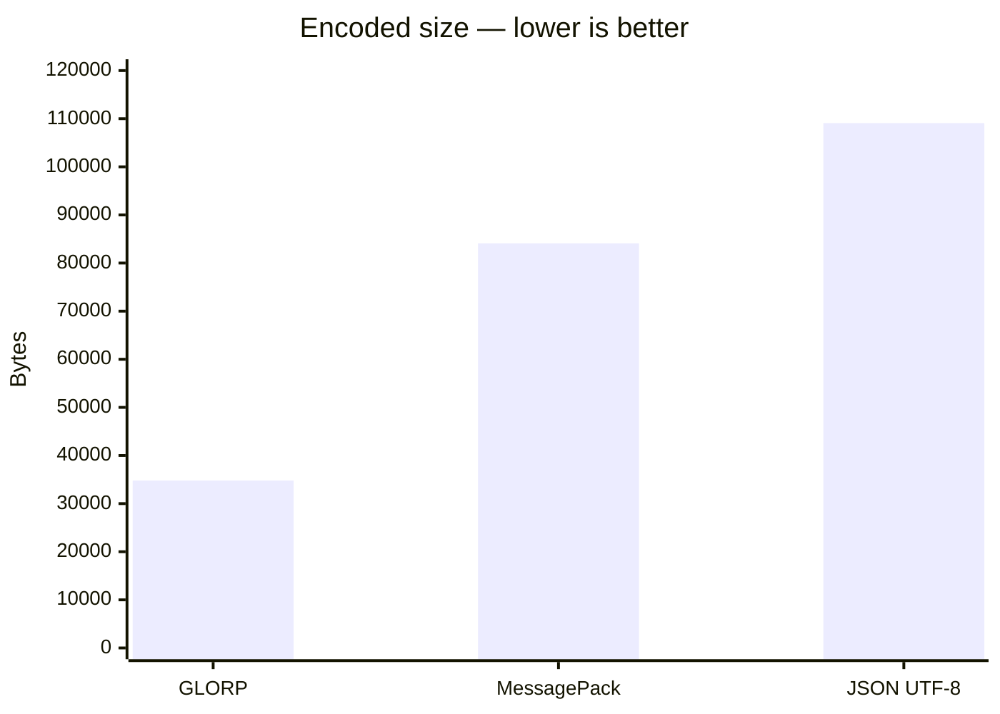
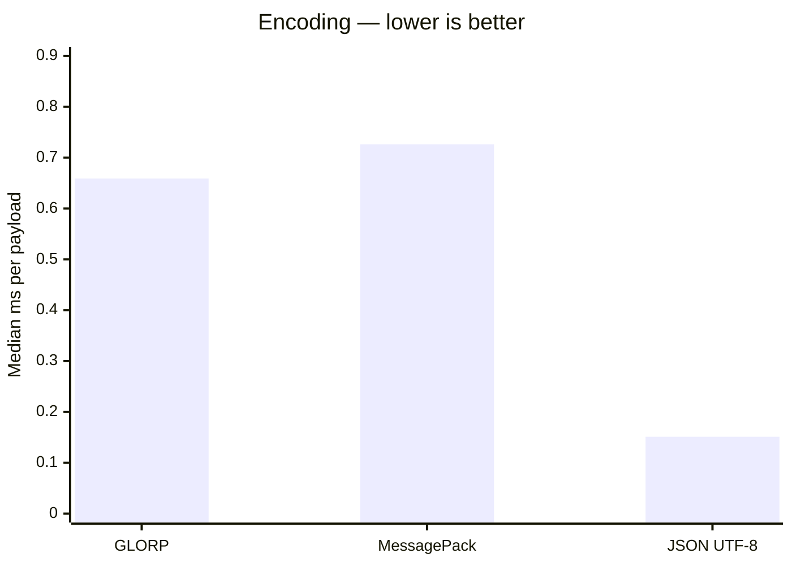
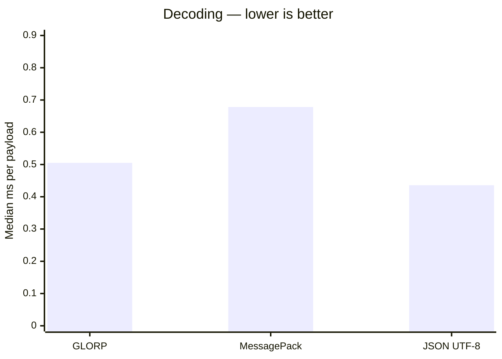

# GLORP

###### Generic Lightweight Object Representation Protocol

A compact binary serialization format with shape and string references for repeated data, plus a buffered writer and
reader.

## GLORP vs MessagePack

On the repeated-record workload below, GLORP produces **58.6% fewer bytes** than `@msgpack/msgpack`, with **9.3% less
encoding time** and **25.5% less decoding time** by measured median.

### Method

- **Input:** 1,000 generated user records with identical keys and repeated names.
- **Measurement:** medians of eight rounds of 100 operations, after 100 warm-up operations per case. Execution order
  rotates between rounds.
- **Validation:** round-trip correctness and encoded-byte checks outside the timed sections.
- **MessagePack:** `@msgpack/msgpack`, using its `encode` and `decode` functions with default options.
- **JSON UTF-8:** `JSON.stringify` plus UTF-8 encoding, and UTF-8 decoding plus `JSON.parse`.
- **Output:** uncompressed bytes.
- **Environment:** Node v26.8.1 · Windows x64 · Intel Core i7-1355U.

| Operation | GLORP median (round range) | MessagePack median (round range) |
|-----------|---------------------------:|---------------------------------:|
| Encode    |  0.6589 ms (0.6120–0.7426) |        0.7261 ms (0.6992–0.8558) |
| Decode    |  0.5051 ms (0.4779–0.6281) |        0.6784 ms (0.5958–0.7688) |

Ranges show minimum and maximum round averages, not confidence intervals. The encoding lead is modest and the ranges
overlap.

### Scope

Repeated layouts and strings benefit GLORP's reference encoding. These results demonstrate that use case, not a
universal advantage over MessagePack.

In a separate random nested-record test, GLORP produced 667,088 bytes versus MessagePack's 652,183 bytes—**2.29% larger
**. MessagePack was also faster in that earlier test, which preceded the buffered-reader optimization; those timings
need to be rerun for the current implementation.

JSON UTF-8 remains faster in both operations on the repeated-record workload, while GLORP uses **68.09% fewer bytes**.