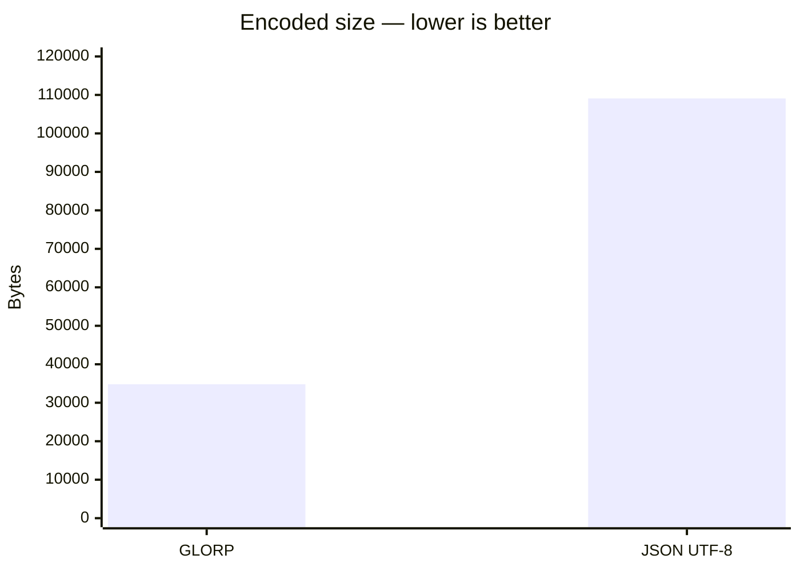
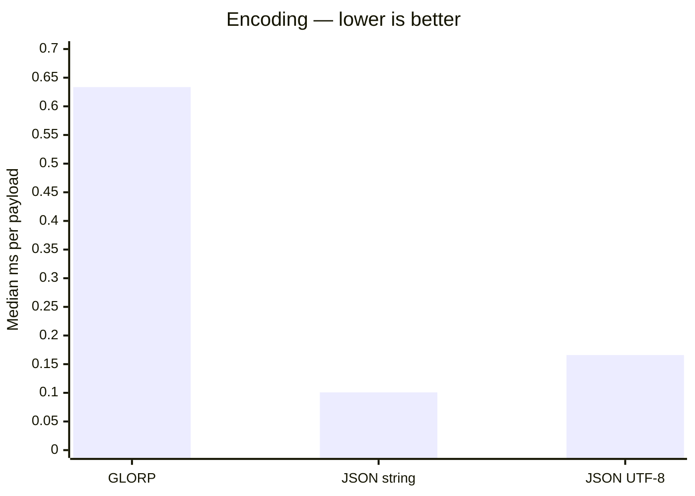
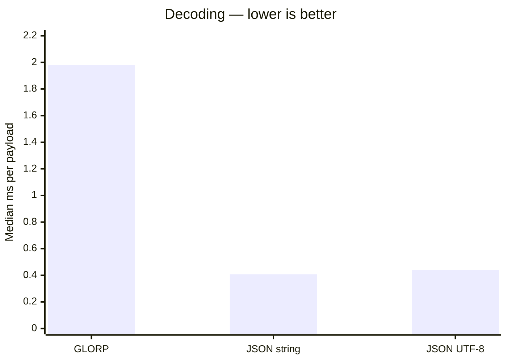

# GLORP

###### Generic Lightweight Object Representation Protocol

Measured on 1.000 generated user records with the same key structure and repeated names.
Uncompressed output; medians of seven rounds of 1,000 operations after 200 warm-up operations per case.

JSON string measures `JSON.stringify` and `JSON.parse`.
JSON UTF-8 additionally includes conversion to/from UTF-8 bytes.

Node v26.8.1 · Windows x64 · Intel Core i7-1355U.

On this machine (my work machine) and workload, GLORP uses **68.09% fewer bytes**, but takes **3.82× as long to encode** and **4.49× as long to decode** as JSON UTF-8.
This workload benefits deduplication; results are not representative of every payload.